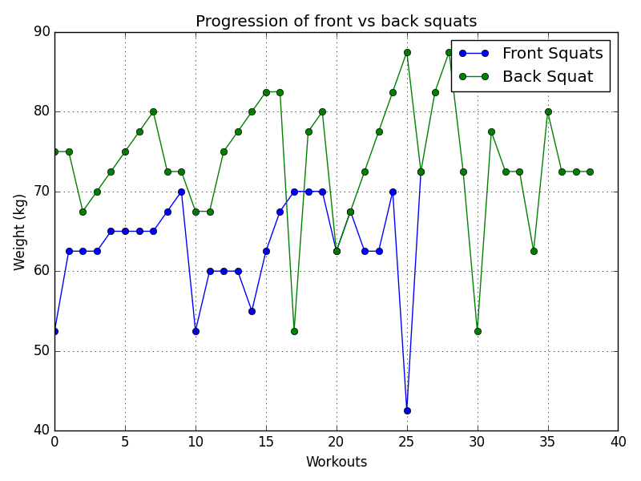

# **BASIC FITNESS DATA ANALYSIS WITH PYTHON AND MATPLOTLIB**
#### **Video Demo**: https://youtu.be/M0Bt5aooXas

## **Description**
This python program analyses the workout data from the app [FitNotes - Gym Workout Log](https://play.google.com/store/apps/details?id=com.github.jamesgay.fitnotes&gl=DE) and provides graphical insight using [Matplotlib](https://matplotlib.org/).

The project is structured as follows:
1. **Code**
    - [project.py](./project.py)
    - [charts.py](./charts.py)
2. **Data**
    - [data.csv](./data.csv)
    - [cleaned.csv](./cleaned.csv)
3. **Testing**
    - [test_project.py](./test_project.py)
    - [sample_data.csv](./sample_data.csv)
4. **Requirements**
    - [requirements.txt](./requirements.txt)
5. **Readme**
    - [README.md](./README.md)
6. **Outputs**
    - [rep_schemes.png](./charts/rep_schemes.png)
    - [bodyparts_worked.png](./charts/bodyparts_worked.png)
    - [Back Squat_progression.png](./charts/Back%20Squat_progression.png)
    - [Bench Press_progression.png](./charts/Bench%20Press_progression.png)
    - [Deadlift_progression.png](./charts/Deadlift_progression.png)
    - [Overhead Press_progression.png](./charts/Overhead%20Press_progression.png)
    - [front_vs_back_squat.png](./charts/front_vs_back_squat.png)
    - [Lifts_Ratio.png](./charts/Lifts_Ratio.png)
    - [top_exercises.png](./charts/top_exercises.png)

The following insights are presented:
- What rep ranges do i work with?
- My most worked body parts
- My progression of back squat, deadlift, bench press and ohp
- My front squat vs. back squat progression
- My big 4 barbell lifts comparison
- My 5 most frequently performed exercise

## **Libraries**
[Matplotlib](https://matplotlib.org/): Matplotlib is a comprehensive library for creating static, animated, and interactive visualizations in Python. Matplotlib makes easy things easy and hard things possible. 

[pytest](https://docs.pytest.org/en/7.4.x/): The pytest framework makes it easy to write small, readable tests, and can scale to support complex functional testing for applications and libraries.

## **Installing Libraries**
`requirements.txt` lists all the libraries that have been used.

Simply use this command to install all the libraries at once:

```
pip install -r requirements.txt
```

## **Usage**

Export the `csv file` from the [app](https://play.google.com/store/apps/details?id=com.github.jamesgay.fitnotes&gl=DE) and name it as `data.csv`.

The program can be run from the `terminal` with the command:
```
python project.py
```
The program then displays **9 charts** and saves them as **.png** files.

## **Functions**

The working and the parameters and the return values of the functions have been documented as `python docstrings`.

The file [project.py](./project.py) has 6 functions to **clean the data and gain useful insights from the data**.

The file [charts.py](./charts.py) has 6 function which then uses these insights to create charts using the **Matplotlib** library. 

## **Cleaning data**

The function [cleanup_1(data)](./project.py) cleans the data but allows duplicates. Since the fields `Distance`, `Distance Unit` and `Time` are empty, they can be deleted. If comment says `snatch grip` the exercise is changed to `Snatch-Grip Deadlift`. After that the new cleaned up data is returned.

Then function [cleanup_2(data)](./project.py) then also removes duplicates from this previously cleaned data and then returns the final duplicate free cleaned up data.

## Some insights gained from this analysis ##


```
This makes sense as I am doing strength focused training with focus on Squats squatting 3 x week rotating between front and back squats.
```


```
My Back Squat is catching up to Deadlift as i deadlift seldom. I overhead press half of my squat which is an optimal ratio but from the figure, I can see that my bench is lacking.
```



```
This shows that I back squat more than I front squat. The difference between the two lifts mostly lie in 10 kg regions.
```

**Author**: Rabindra Neupane